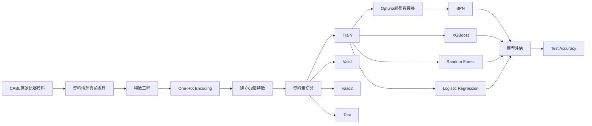

<h1 align="center">
CPBL_CrawlerBPN 
(使用2015-2022年 統一隊與兄弟隊比賽數據)
</h1>

## 說明
#### 研究目標：

   1. 利用投手與打擊數據
   2. 預測比賽勝負結果

#### 問題：

1. 哪些數據最影響勝負？
2. 傳統機器學習與神經網路誰比較好？
3. 能否建立實際預測模型？

#### 方法:
利用 PyTorch 實作倒傳遞神經網路（Backpropagation Neural Network, BPN），建立深度學習模型進行比賽勝負預測。

## 資料集（Dataset）
利用API的方式，使用 [中華職業棒球大聯盟](https://www.cpbl.com.tw/)之數據

## 網絡說明
#### 三層網絡架構圖

  

#### 網路架構（Neural Network Architecture）
- 使用PyTorch框架創建一個帶有3層全連接網絡模型  
- 隱藏層使用 Mish 非線性激活函數
- 輸出層搭配 CrossEntropyLoss 進行二元分類
- 損失函數:交叉熵(CrossEntropyLoss)
- 最佳化器(Optimizer)：Adam()
- 學習率衰減：ReduceLROnPlateau 

#### 資料切分

   資料依時間順序切分為：

   | Dataset | 筆數 |
   |----------|----------|
   | Train | 260 |
   | Valid | 26 |
   | Valid2 | 52 |
   | Test | 17 |

   其中 Test 資料未參與模型訓練。

   在 BPN 模型訓練階段，進一步於 Train 資料中採用 TimeSeriesSplit(n_splits=4) 進行時序交叉驗證，以避免未來資訊洩漏至過去資料。

#### Optuna 架構設定

1. 設定每個超參數搜尋範圍

      | 超參數 | 說明 | 搜尋範圍 |
      |---|---|---|
      | dropout1 | 第一層 Dropout 丟棄率 | 0 ~ 0.5 |
      | dropout2 | 第二層 Dropout 丟棄率 | 0 ~ 0.5 |
      | learning_rate | 學習率 | 1e-5 ~ 1e-2 |
      | epochs | 訓練循環次數 | 50 ~ 150 |
      | unit1 | 第一隱藏層神經元數 | 4 ~ 64 |
      | unit2 | 第二隱藏層神經元數 | 4 ~ 64 |

2. 本研究採用 Optuna 多目標最佳化（Multi-objective Optimization），同時最小化驗證集損失函數（Loss）並最大化驗證集準確率（Accuracy）。

3. Trial 次數設定

   目前實驗將 `n_trials` 設定為：
   n_trials = 100，設定為 100，以避免在小型資料集上進行過多 trial 而造成驗證集過擬合。

## 架構

## 輸出結果
#### Optuna 最佳超參數

| 參數 | 數值 |
|--------|--------|
| unit1 | 29 |
| unit2 | 43 |
| dropout1 | 0.2744 |
| dropout2 | 0.3576 |
| learning_rate | 0.00603 |
| epochs | 105 |

最佳驗證結果：

- Valid Loss：0.7006
- Valid Accuracy：55.05%

### BPN模型與其他模型
| Model | Test Accuracy |
|---------|---------|
| Logistic Regression | 0.588 |
| Random Forest | 0.471 |
| XGBoost | 0.588 |
| BPN | 0.706 |

## 結論

本研究比較 Logistic Regression、Random Forest、XGBoost 與 BPN 四種模型。

在相同資料集與特徵條件下，BPN 模型於測試集取得最高準確率 70.6%，顯示神經網路模型能有效學習投打數據與比賽結果間的非線性關係，具有較佳的預測能力。
## 貢獻

1. 以爬蟲方式，取得中華職棒網頁中的數據資料
2. 考量數據中含有時間資訊
3. 透過Python中Pytorch框架建立模型(非使用統計軟體)